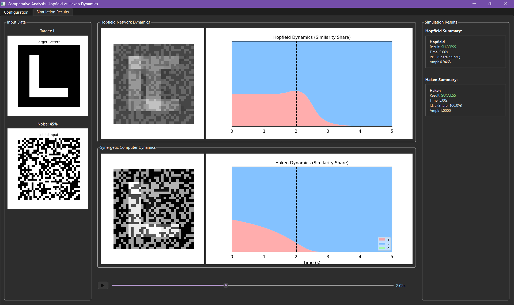

# Comparative Dynamics of Associative Memory: Continuous Hopfield Network vs. Haken Synergetic Computer

[](https://www.python.org/downloads/)
[](https://pypi.org/project/PyQt6/)

An interactive computational framework for comparing the pattern retrieval dynamics and associative memory mechanisms of continuous-time **Hopfield Neural Networks** and **Haken's Synergetic Computers** under high noise conditions (up to 50%).



---

## Theoretical Foundations & Mathematical Modeling

Both systems solve the problem of recovering clean prototype vectors from heavily corrupted binary inputs $\mathbf{q}(0) \in \{-1, 1\}^N$, but they rely on fundamentally distinct physical paradigms.

### 1. Continuous Hopfield Network (Energy Minimization)
The continuous Hopfield model is defined as a system of coupled non-linear differential equations:
$$\frac{d\mathbf{u}}{dt} = -\frac{\mathbf{u}}{\tau} + W \tanh(\beta \mathbf{u})$$

- **Synaptic Weight Matrix ($W$):** Constructed using the orthogonal **Projection Rule (Pseudoinverse)** to maximize storage capacity and suppress cross-talk between correlated patterns:
  $$W = X X^+ = X (X^T X)^{-1} X^T, \quad \text{with } \text{diag}(W) = 0$$
- **Convergence Mechanism:** Trajectories evolve along the gradient of the Lyapunov energy function:
  $$E = -\frac{1}{2} \mathbf{v}^T W \mathbf{v} + \frac{1}{\tau} \sum_i \int_0^{v_i} g^{-1}(s) \, ds$$

### 2. Haken's Synergetic Computer (Slaving Principle & Non-linear Attention)
Haken’s paradigm treats pattern recognition as a non-equilibrium phase transition where order parameters compete:
$$\frac{d\mathbf{q}}{dt} = \sum_{k} \lambda_k \mathbf{v}_k (\mathbf{v}_k^+ \cdot \mathbf{q})^2 - B \mathbf{q} \|\mathbf{q}\|^2 - C \mathbf{q} \sum_{k} (\mathbf{v}_k^+ \cdot \mathbf{q})^2$$

- **Order Parameters:** Amplitudes $\xi_k = \mathbf{v}_k^+ \cdot \mathbf{q}$ represent overlap with prototype patterns $\mathbf{v}_k$, where $\mathbf{v}_k^+$ are adjoint biorthogonal vectors ($V^+ = (V^T V)^{-1} V^T$).
- **Non-linear Competition:** The cubic saturation term ($B$) and cross-inhibition ($C$) enforce winner-take-all dynamics without spurious local minima.

### 3. Strict Parameter Synchronization
To ensure objective benchmarking, linear growth rates near the origin are strictly synchronized:
$$\lambda = \beta - 1$$
$$B + C = \lambda \implies B = 0.1\lambda, \quad C = 0.9\lambda$$

Numerical integration is carried out via a 4th-order **Runge-Kutta solver (RK4)** with adaptive time steps and step-clamping.

---

## Key Experimental Insights & Failure Modes

- **Noise Resilience (45% Inversion):** 
  - At 45% salt-and-pepper noise on $32 \times 32$ letters (T, L, X), the Synergetic Computer shows superior selectivity due to cubic attention suppression of non-target order parameters.
  - The Continuous Hopfield Network exhibits smooth energy relaxation but is susceptible to cross-talk oscillations when prototype vectors share high spatial correlation.
- **Failure Modes & Boundaries:**
  - **Hopfield:** Degrades into mixed/spurious states when pattern correlation $\rho > 0.4$ or when $\beta < 1.0$ (disappearance of bistable wells).
  - **Haken:** Degrades if initial noise inverts the scalar product sign ($\mathbf{v}_k^+ \cdot \mathbf{q}(0) < 0$), causing the order parameter to be permanently suppressed by the $\max(0, \xi)$ activation clamp.

---

## Project Structure

```text
├── core/
│   ├── networks/
│   │   ├── base.py         # Abstract DynamicNetwork base class
│   │   ├── hopfield.py     # Continuous Hopfield ODE implementation
│   │   └── synergetic.py   # Haken Synergetic Computer ODE implementation
│   ├── patterns.py         # 32x32 binary pattern generators & noise injector
│   └── solver.py           # 4th-order Runge-Kutta numerical integrator
├── gui/
│   ├── canvas.py           # Matplotlib QWidget integration
│   ├── config_tab.py       # Simulation parameter controls (PyQt6)
│   ├── main_window.py      # Main application window & parameter coupling
│   └── results_tab.py      # Real-time state visualizer & stacked share charts
├── utils/
│   ├── analytics.py        # Energy share decomposition and reporting
│   └── image_processing.py # State vector reshaping and normalization
├── materials/              # Foundational papers (Hopfield 1982/1984, Haken 2004)
├── docs/                   # UI preview assets
├── main.py                 # Application entry point
└── requirements.txt        # Minimal dependency specifications
```

---

## Quickstart & Installation

1. **Clone the repository:**
   ```bash
   git clone https://github.com/Maxogrammer/dynamical-associative-memory.git
   cd dynamical-associative-memory
   ```

2. **Set up a virtual environment and install dependencies:**
   ```bash
   python -m venv venv
   # Windows:
   venv\Scripts\activate
   # Linux/macOS:
   source venv/bin/activate

   pip install -r requirements.txt
   ```

3. **Run the simulation:**
   ```bash
   python main.py
   ```

---

## References

1. **Hopfield, J. J. (1982).** *Neural networks and physical systems with emergent collective computational abilities.* PNAS, 79(8), 2554-2558.
2. **Hopfield, J. J. (1984).** *Neurons with graded response have collective computational properties like those of two-state neurons.* PNAS, 81(10), 3088-3092.
3. **Haken, H. (2004).** *Synergetic Computers and Cognition: A Top-Down Approach to Neural Structure of Action and Perception.* Springer.
